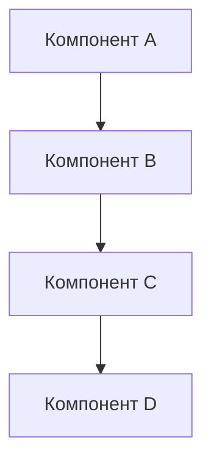

# Cursor Boilerplate

## Описание проекта
В этом разделе должно быть подробное описание проекта, его назначение, цели и задачи, которые он решает.

- **Назначение проекта**: 
- **Основные цели**: 
- **Ключевые функциональности**:
- **Целевая аудитория**:

## Используемые технологии
Список всех технологий, библиотек, фреймворков и инструментов, используемых в проекте.

### Фронтенд
- **Основной фреймворк**:
- **Стейт-менеджмент**:
- **UI библиотека**:
- **Тестирование**:

### Бэкенд
- **Основной фреймворк/язык**:
- **База данных**:
- **ORM/Query Builder**:
- **API**:
- **Тестирование**:

### DevOps и инфраструктура
- **CI/CD**:
- **Контейнеризация**:
- **Облачные сервисы**:
- **Мониторинг**:

## Архитектура проекта
Описание архитектуры проекта, включая диаграммы и схемы.

- **Общая архитектура**: [Перейти к документации по архитектуре](./docs/architecture.md)
- **Схема взаимодействия компонентов**: [Перейти к диаграммам взаимодействия](./docs/api-documentation.md)
- **Принципы разработки**: 
- **Паттерны проектирования**:

## Структура папок
Подробное описание структуры папок проекта и их назначения.

```
/
├── frontend/              # Фронтенд часть проекта
│   ├── src/               # Исходный код
│   ├── tests/             # Тесты
│   └── ...
├── backend/               # Бэкенд часть проекта
│   ├── src/               # Исходный код
│   ├── tests/             # Тесты
│   └── ...
├── docs/                  # Документация
├── tools/                 # Вспомогательные инструменты
└── ...
```

## План создания проекта по шагам
Поэтапный план разработки проекта с подробным описанием каждого шага.

1. **Этап 1: Инициализация проекта**
   - Задача 1.1: 
   - Задача 1.2:

2. **Этап 2: Разработка базовых компонентов**
   - Задача 2.1:
   - Задача 2.2:

3. **Этап 3: Реализация основного функционала**
   - Задача 3.1:
   - Задача 3.2:

4. **Этап 4: Интеграция и тестирование**
   - Задача 4.1:
   - Задача 4.2:

5. **Этап 5: Финализация и запуск**
   - Задача 5.1:
   - Задача 5.2:

## Детализированный список use cases
Подробное описание всех пользовательских сценариев проекта.

### Use Case 1: [Название]
- **Описание**: 
- **Действующие лица**:
- **Предусловия**:
- **Постусловия**:
- **Основной сценарий**:
- **Альтернативные сценарии**:

### Use Case 2: [Название]
- **Описание**:
- **Действующие лица**:
- **Предусловия**:
- **Постусловия**:
- **Основной сценарий**:
- **Альтернативные сценарии**:

## Автотесты для каждого use case
Список автоматических тестов для каждого из описанных use cases.

### Тесты для Use Case 1
1. **Тест 1.1**: Проверка [описание]
   - **Входные данные**:
   - **Ожидаемый результат**:
   - **Критерии прохождения**:

2. **Тест 1.2**: Проверка [описание]
   - **Входные данные**:
   - **Ожидаемый результат**:
   - **Критерии прохождения**:

### Тесты для Use Case 2
1. **Тест 2.1**: Проверка [описание]
   - **Входные данные**:
   - **Ожидаемый результат**:
   - **Критерии прохождения**:

## Автотесты для edge cases и corner cases
Список автоматических тестов для проверки граничных и особых случаев.

### Edge Cases
1. **Тест E1**: Проверка [описание]
   - **Условия**:
   - **Входные данные**:
   - **Ожидаемый результат**:

2. **Тест E2**: Проверка [описание]
   - **Условия**:
   - **Входные данные**:
   - **Ожидаемый результат**:

### Corner Cases
1. **Тест C1**: Проверка [описание]
   - **Условия**:
   - **Входные данные**:
   - **Ожидаемый результат**:

2. **Тест C2**: Проверка [описание]
   - **Условия**:
   - **Входные данные**:
   - **Ожидаемый результат**:

## Технические автотесты
Список технических автоматических тестов для проверки работоспособности системы.

### Тесты производительности
1. **Тест P1**: [описание]
   - **Метрики**:
   - **Условия**:
   - **Критерии прохождения**:

### Тесты безопасности
1. **Тест S1**: [описание]
   - **Цель**:
   - **Методика**:
   - **Критерии прохождения**:

### Тесты совместимости
1. **Тест C1**: [описание]
   - **Платформы**:
   - **Критерии прохождения**:

## Технические инструменты

### Мониторинг нагрузки на сервис
Для мониторинга нагрузки на сервис будет использоваться:
- **Инструмент 1**:
  - Настройка:
  - Метрики:
  - Алерты:
- **Инструмент 2**:
  - Настройка:
  - Метрики:
  - Алерты:

### Визуализация архитектуры проекта
Для визуализации архитектуры проекта используется Mermaid.js, который позволяет создавать диаграммы прямо в Markdown-файлах.

Документация по архитектуре проекта разделена на следующие файлы:
- [Общая архитектура системы](./docs/architecture.md)
- [Документация API](./docs/api-documentation.md)
- [Схема базы данных](./docs/database-schema.md)
- [Структура фронтенда](./docs/frontend-structure.md)
- [Процесс разработки](./docs/development-workflow.md)

#### Как использовать Mermaid.js

Mermaid.js позволяет создавать диаграммы в Markdown-файлах с помощью следующего синтаксиса:

```markdown

```

GitHub автоматически отображает эти диаграммы при просмотре Markdown-файлов в репозитории.

Для локального просмотра или встраивания в веб-приложение можно подключить Mermaid.js через CDN:

```html
<script src="https://cdn.jsdelivr.net/npm/mermaid/dist/mermaid.min.js"></script>
<script>mermaid.initialize({startOnLoad:true});</script>
```

Или установить через npm:

```bash
npm install mermaid
```

### Беклог проекта
Беклог проекта ведется в файле [BACKLOG.md](./BACKLOG.md) и содержит:
- Список всех задач
- Статус выполнения
- Приоритеты
- Ответственных
- Сроки выполнения

## Подход TDD (Test-Driven Development)
В проекте используется подход TDD, который предполагает написание тестов до реализации функционала. Процесс разработки с использованием TDD включает следующие шаги:

1. **Написание теста**: Создание автоматического теста, который описывает новую функциональность или исправление ошибки.
2. **Запуск теста и проверка его непрохождения**: Убедиться, что тест не проходит, так как функциональность еще не реализована.
3. **Реализация функциональности**: Написание минимального кода, необходимого для прохождения теста.
4. **Запуск теста и проверка его прохождения**: Убедиться, что тест проходит успешно.
5. **Рефакторинг**: Улучшение кода без изменения его функциональности.
6. **Повторение**: Повторение процесса для следующей функциональности.

## Правила контрибьютинга
Описание правил и процесса контрибьютинга в проект.

1. **Форкинг и клонирование репозитория**:
2. **Создание ветки**:
3. **Внесение изменений**:
4. **Создание пулл-реквеста**:
5. **Код-ревью**:
6. **Мерж**:

## Лицензия
Информация о лицензии проекта. 