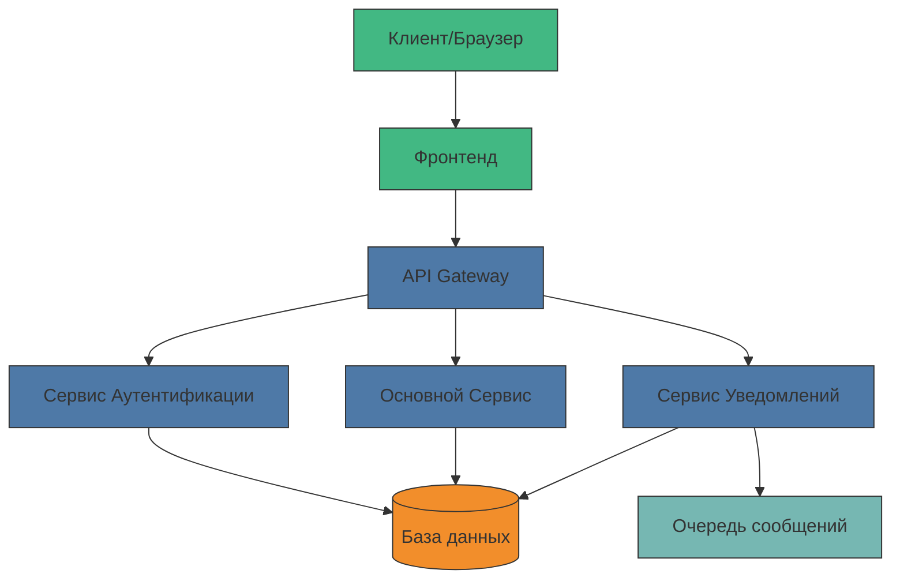
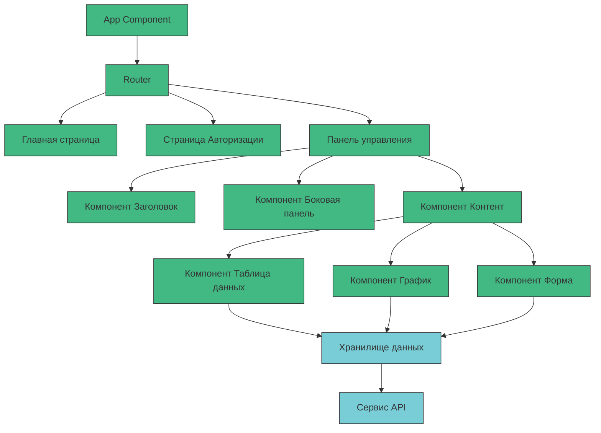
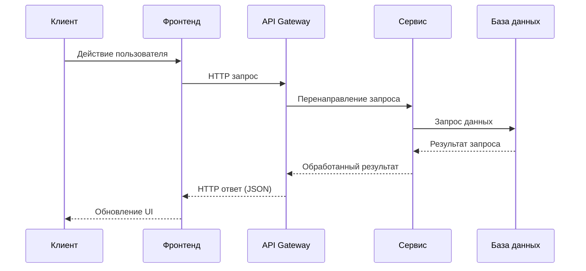
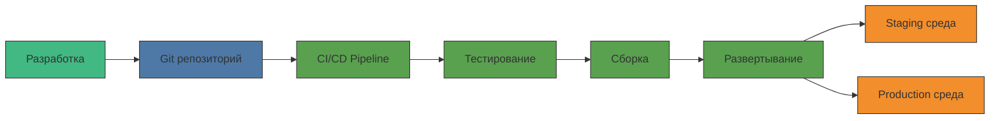
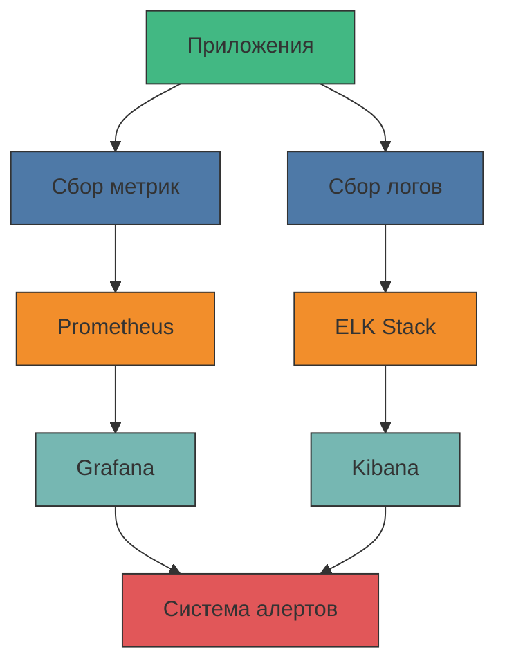

# Общая архитектура системы

В этом документе описана общая архитектура системы с использованием диаграмм Mermaid.js.

## Высокоуровневая архитектура

## Детальная архитектура

### Фронтенд

### Бэкенд

```mermaid
graph TD
    API[API Gateway] --> AuthService[Сервис Аутентификации]
    API --> CoreService[Основной Сервис]
    API --> NotificationService[Сервис Уведомлений]
    
    subgraph "Сервис Аутентификации"
        AuthController[Контроллер Auth] --> AuthLogic[Бизнес-логика Auth]
        AuthLogic --> AuthRepo[Репозиторий Auth]
        AuthRepo --> DB1[(База данных)]
    end
    
    subgraph "Основной Сервис"
        CoreController[Контроллер Core] --> CoreLogic[Бизнес-логика Core]
        CoreLogic --> CoreRepo[Репозиторий Core]
        CoreRepo --> DB2[(База данных)]
    end
    
    subgraph "Сервис Уведомлений"
        NotifController[Контроллер Notification] --> NotifLogic[Бизнес-логика Notification]
        NotifLogic --> NotifRepo[Репозиторий Notification]
        NotifRepo --> DB3[(База данных)]
        NotifLogic --> Queue[Очередь сообщений]
    end
    
    classDef gateway fill:#4e79a7,stroke:#333,stroke-width:1px;
    classDef controller fill:#a0cbe8,stroke:#333,stroke-width:1px;
    classDef logic fill:#7eb0d5,stroke:#333,stroke-width:1px;
    classDef repo fill:#b3e2cd,stroke:#333,stroke-width:1px;
    classDef database fill:#f28e2b,stroke:#333,stroke-width:1px;
    classDef queue fill:#76b7b2,stroke:#333,stroke-width:1px;
    
    class API gateway;
    class AuthController,CoreController,NotifController controller;
    class AuthLogic,CoreLogic,NotifLogic logic;
    class AuthRepo,CoreRepo,NotifRepo repo;
    class DB1,DB2,DB3 database;
    class Queue queue;
```

## Поток данных

## Процессы развертывания

## Мониторинг и логирование

Эти диаграммы представляют различные аспекты архитектуры системы и могут быть адаптированы под конкретный проект. Они помогут вам, как начинающему разработчику, лучше понять структуру и взаимодействие компонентов системы. 