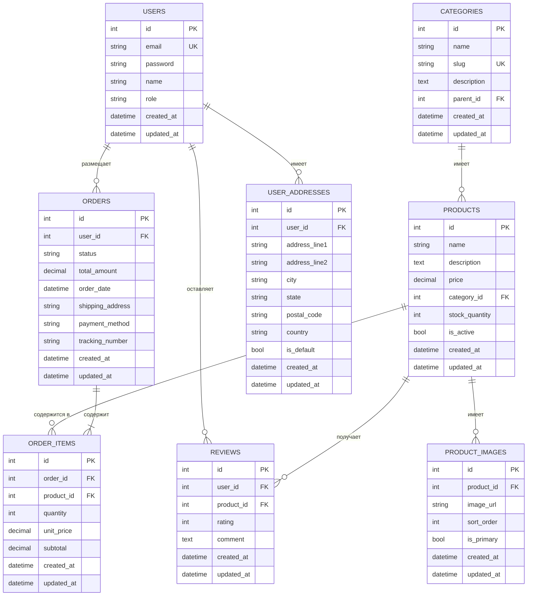
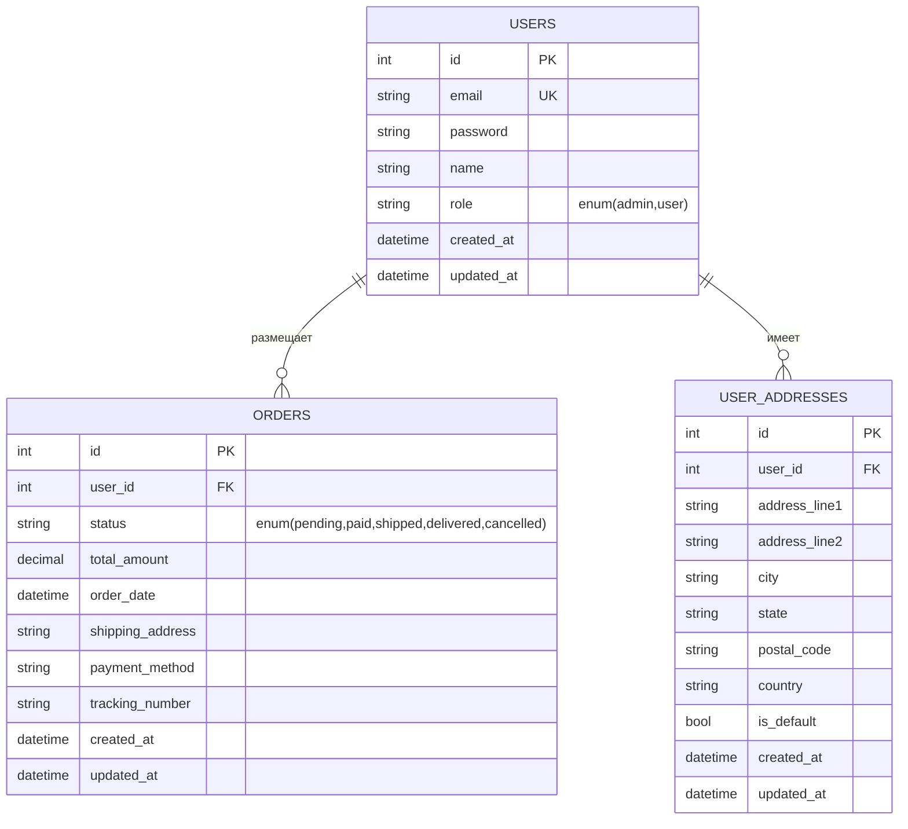
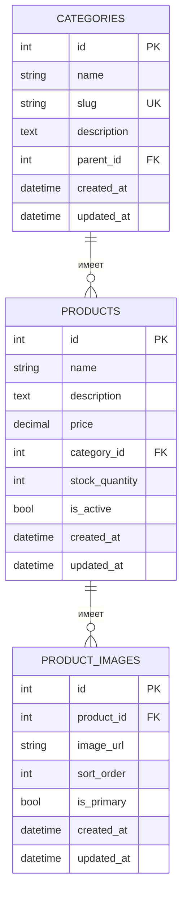
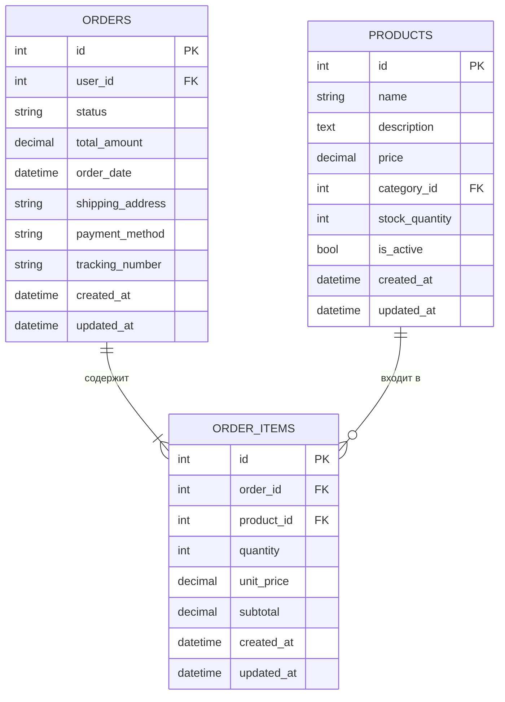
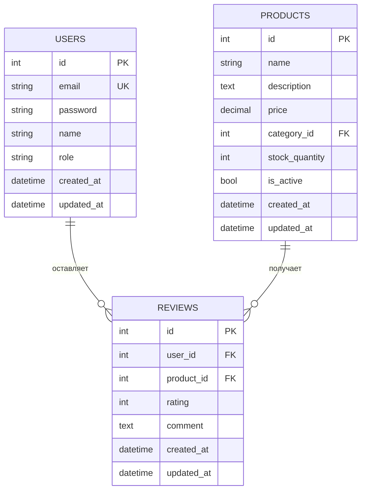
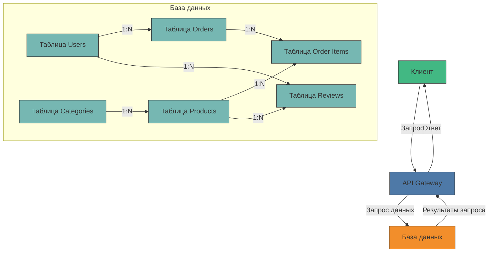

# Схема базы данных

В этом документе представлена схема базы данных проекта с использованием диаграмм Mermaid.js.

## Общая ER-диаграмма



## Детализация отношений

### Таблица пользователей и заказов



### Таблица продуктов и категорий



### Таблица заказов и позиций заказа



### Таблица отзывов



## Индексы и оптимизация

Для оптимизации производительности базы данных рекомендуется создать следующие индексы:

```sql
-- Индексы для таблицы USERS
CREATE INDEX idx_users_email ON users (email);
CREATE INDEX idx_users_role ON users (role);

-- Индексы для таблицы PRODUCTS
CREATE INDEX idx_products_category_id ON products (category_id);
CREATE INDEX idx_products_is_active ON products (is_active);
CREATE INDEX idx_products_price ON products (price);

-- Индексы для таблицы CATEGORIES
CREATE INDEX idx_categories_parent_id ON categories (parent_id);
CREATE INDEX idx_categories_slug ON categories (slug);

-- Индексы для таблицы ORDERS
CREATE INDEX idx_orders_user_id ON orders (user_id);
CREATE INDEX idx_orders_status ON orders (status);
CREATE INDEX idx_orders_order_date ON orders (order_date);

-- Индексы для таблицы ORDER_ITEMS
CREATE INDEX idx_order_items_order_id ON order_items (order_id);
CREATE INDEX idx_order_items_product_id ON order_items (product_id);

-- Индексы для таблицы USER_ADDRESSES
CREATE INDEX idx_user_addresses_user_id ON user_addresses (user_id);
CREATE INDEX idx_user_addresses_is_default ON user_addresses (is_default);

-- Индексы для таблицы PRODUCT_IMAGES
CREATE INDEX idx_product_images_product_id ON product_images (product_id);
CREATE INDEX idx_product_images_is_primary ON product_images (is_primary);

-- Индексы для таблицы REVIEWS
CREATE INDEX idx_reviews_user_id ON reviews (user_id);
CREATE INDEX idx_reviews_product_id ON reviews (product_id);
CREATE INDEX idx_reviews_rating ON reviews (rating);
```

## Диаграмма потока данных



## Миграции базы данных

Рекомендуется создать миграции для создания схемы базы данных. Миграции должны выполняться в следующем порядке:

1. Создание таблицы `users`
2. Создание таблицы `categories`
3. Создание таблицы `products`
4. Создание таблицы `orders`
5. Создание таблицы `order_items`
6. Создание таблицы `user_addresses`
7. Создание таблицы `product_images`
8. Создание таблицы `reviews`

Эта схема базы данных представляет стандартную структуру для интернет-магазина и может быть адаптирована под конкретные требования проекта. Диаграммы Mermaid.js помогают визуализировать структуру таблиц и их взаимосвязи, что упрощает понимание архитектуры базы данных для начинающих разработчиков. 