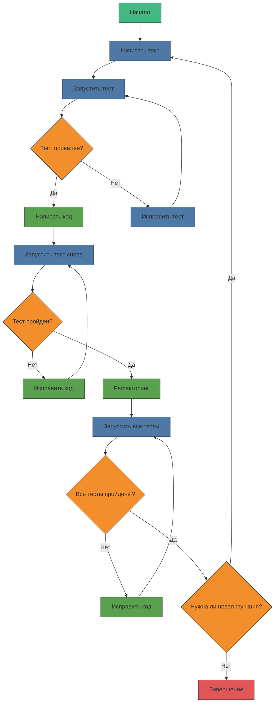
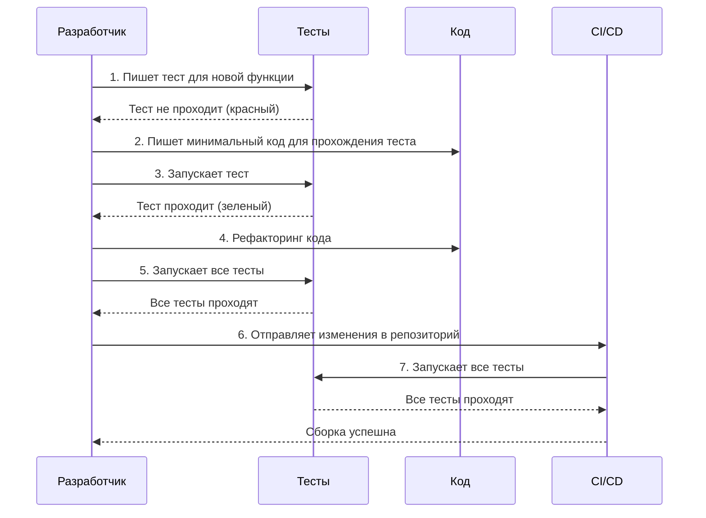
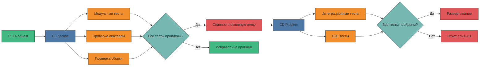
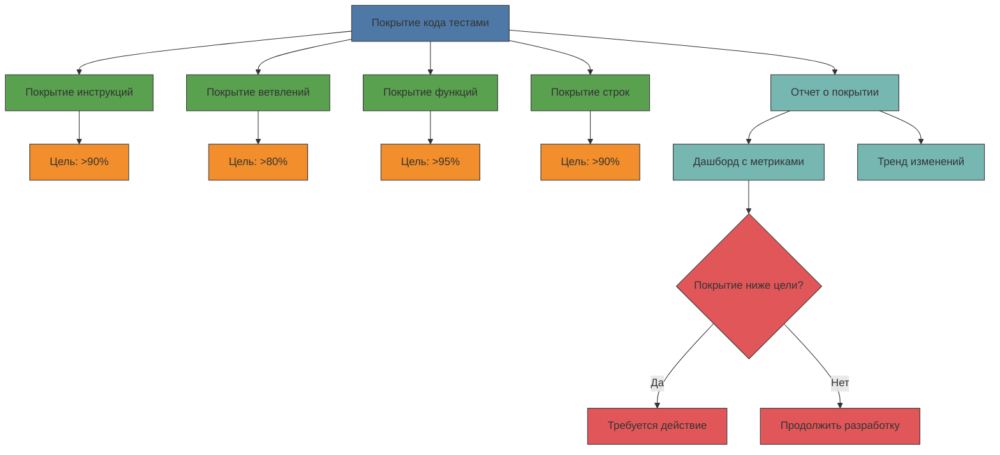

# Процесс разработки (TDD)

В этом документе описан процесс разработки проекта с использованием методологии Test-Driven Development (TDD) и наглядными диаграммами Mermaid.js.

## Цикл разработки TDD



## Детальный процесс TDD для новой функциональности



## Процесс разработки целиком

```mermaid
graph LR
    Start[Старт проекта] --> Planning[Планирование]
    Planning --> UserStories[Пользовательские истории]
    UserStories --> TestCases[Тестовые случаи]
    TestCases --> TestFirst[Сначала тесты - Red]
    TestFirst --> CodeImplementation[Реализация кода - Green]
    CodeImplementation --> Refactoring[Рефакторинг - Blue]
    Refactoring --> ReviewAndIntegration[Ревью и интеграция]
    ReviewAndIntegration --> NextStory{Следующая история?}
    NextStory -->|Да| TestCases
    NextStory -->|Нет| Release[Релиз]
    
    classDef phase fill:#42b883,stroke:#333,stroke-width:1px;
    classDef planning fill:#4e79a7,stroke:#333,stroke-width:1px;
    classDef testing fill:#f28e2b,stroke:#333,stroke-width:1px;
    classDef coding fill:#59a14f,stroke:#333,stroke-width:1px;
    classDef release fill:#e15759,stroke:#333,stroke-width:1px;
    
    class Start,Release phase;
    class Planning,UserStories planning;
    class TestCases,TestFirst testing;
    class CodeImplementation,Refactoring coding;
    class ReviewAndIntegration,NextStory release;
```



## Иерархия тестов

```mermaid
graph TD
    Tests[Тесты] --> UnitTests[Модульные тесты]
    Tests --> IntegrationTests[Интеграционные тесты]
    Tests --> E2ETests[End-to-End тесты]
    
    UnitTests --> ComponentTests[Тесты компонентов]
    UnitTests --> ServiceTests[Тесты сервисов]
    UnitTests --> UtilTests[Тесты утилит]
    UnitTests --> HookTests[Тесты хуков]
    
    IntegrationTests --> ApiIntegration[Интеграция с API]
    IntegrationTests --> StoreIntegration[Интеграция с хранилищем]
    IntegrationTests --> DbIntegration[Интеграция с БД]
    
    E2ETests --> UserFlows[Пользовательские сценарии]
    E2ETests --> Regression[Регрессионные тесты]
    E2ETests --> Performance[Тесты производительности]
    
    classDef main fill:#4e79a7,stroke:#333,stroke-width:1px;
    classDef unit fill:#59a14f,stroke:#333,stroke-width:1px;
    classDef integration fill:#f28e2b,stroke:#333,stroke-width:1px;
    classDef e2e fill:#e15759,stroke:#333,stroke-width:1px;
    
    class Tests main;
    class UnitTests,ComponentTests,ServiceTests,UtilTests,HookTests unit;
    class IntegrationTests,ApiIntegration,StoreIntegration,DbIntegration integration;
    class E2ETests,UserFlows,Regression,Performance e2e;
```



## Распределение тестов в проекте

```mermaid
graph TD
    Project[Проект] --> Frontend[Фронтенд]
    Project --> Backend[Бэкенд]
    
    Frontend --> ReactTests[React-компоненты]
    Frontend --> ReduxTests[Redux]
    Frontend --> ServiceTests[API-сервисы]
    Frontend --> UtilTests[Утилиты]
    
    Backend --> ControllerTests[Контроллеры]
    Backend --> ModelTests[Модели]
    Backend --> RepositoryTests[Репозитории]
    Backend --> ServiceLayerTests[Сервисный слой]
    Backend --> ValidationTests[Валидация]
    
    ReactTests --> SnapTests[Снимки]
    ReactTests --> RenderTests[Рендеринг]
    ReactTests --> EventTests[События]
    ReactTests --> HookTests[Хуки]
    
    ReduxTests --> ActionTests[Actions]
    ReduxTests --> ReducerTests[Reducers]
    ReduxTests --> SelectorTests[Selectors]
    ReduxTests --> EffectTests[Side Effects]
    
    ControllerTests --> RouteTests[Маршруты]
    ControllerTests --> RequestTests[Запросы]
    ControllerTests --> ResponseTests[Ответы]
    ControllerTests --> AuthTests[Авторизация]
    
    classDef project fill:#4e79a7,stroke:#333,stroke-width:1px;
    classDef layer fill:#59a14f,stroke:#333,stroke-width:1px;
    classDef group fill:#f28e2b,stroke:#333,stroke-width:1px;
    classDef test fill:#76b7b2,stroke:#333,stroke-width:1px;
    
    class Project project;
    class Frontend,Backend layer;
    class ReactTests,ReduxTests,ServiceTests,UtilTests,ControllerTests,ModelTests,RepositoryTests,ServiceLayerTests,ValidationTests group;
    class SnapTests,RenderTests,EventTests,HookTests,ActionTests,ReducerTests,SelectorTests,EffectTests,RouteTests,RequestTests,ResponseTests,AuthTests test;
```



## Примеры тестов для фронтенда

### Тесты React-компонентов

```javascript
// Button.test.js
import { render, fireEvent, screen } from '@testing-library/react';
import Button from './Button';

describe('Button Component', () => {
  test('рендерится с правильным текстом', () => {
    render(<Button>Нажми меня</Button>);
    expect(screen.getByText('Нажми меня')).toBeInTheDocument();
  });

  test('вызывает onClick при клике', () => {
    const handleClick = jest.fn();
    render(<Button onClick={handleClick}>Нажми меня</Button>);
    fireEvent.click(screen.getByText('Нажми меня'));
    expect(handleClick).toHaveBeenCalledTimes(1);
  });
  
  test('не активна, когда disabled={true}', () => {
    const handleClick = jest.fn();
    render(<Button onClick={handleClick} disabled>Нажми меня</Button>);
    fireEvent.click(screen.getByText('Нажми меня'));
    expect(handleClick).not.toHaveBeenCalled();
    expect(screen.getByText('Нажми меня')).toBeDisabled();
  });
});
```

### Тесты Redux

```javascript
// authReducer.test.js
import authReducer from './authReducer';
import { login, logout } from './authActions';

describe('Auth Reducer', () => {
  test('должен вернуть начальное состояние', () => {
    expect(authReducer(undefined, {})).toEqual({
      user: null,
      isAuthenticated: false,
      loading: false,
      error: null
    });
  });

  test('должен обработать успешный вход', () => {
    const user = { id: 1, name: 'Иван' };
    expect(
      authReducer(undefined, {
        type: login.fulfilled.type,
        payload: user
      })
    ).toEqual({
      user,
      isAuthenticated: true,
      loading: false,
      error: null
    });
  });

  test('должен обработать выход', () => {
    const initialState = {
      user: { id: 1, name: 'Иван' },
      isAuthenticated: true,
      loading: false,
      error: null
    };
    expect(
      authReducer(initialState, {
        type: logout.type
      })
    ).toEqual({
      user: null,
      isAuthenticated: false,
      loading: false,
      error: null
    });
  });
});
```

## Примеры тестов для бэкенда

### Тесты контроллеров

```javascript
// userController.test.js
const request = require('supertest');
const app = require('../app');
const db = require('../models');

describe('User Controller', () => {
  beforeAll(async () => {
    await db.sequelize.sync({ force: true });
  });

  beforeEach(async () => {
    await db.User.destroy({ where: {} });
  });

  test('должен создать нового пользователя', async () => {
    const userData = {
      name: 'Тестовый пользователь',
      email: 'test@example.com',
      password: 'password123'
    };

    const response = await request(app)
      .post('/api/users')
      .send(userData)
      .expect(201);

    expect(response.body).toHaveProperty('id');
    expect(response.body.name).toBe(userData.name);
    expect(response.body.email).toBe(userData.email);
    expect(response.body).not.toHaveProperty('password');
  });

  test('должен вернуть ошибку при отсутствии обязательных полей', async () => {
    const userData = {
      name: 'Тестовый пользователь'
    };

    const response = await request(app)
      .post('/api/users')
      .send(userData)
      .expect(422);

    expect(response.body).toHaveProperty('errors');
    expect(response.body.errors).toHaveProperty('email');
    expect(response.body.errors).toHaveProperty('password');
  });
});
```

### Тесты сервисов

```javascript
// authService.test.js
const authService = require('./authService');
const db = require('../models');
const bcrypt = require('bcrypt');
const jwt = require('jsonwebtoken');

jest.mock('../models');
jest.mock('bcrypt');
jest.mock('jsonwebtoken');

describe('Auth Service', () => {
  beforeEach(() => {
    jest.clearAllMocks();
  });

  test('login должен вернуть токен для правильных учетных данных', async () => {
    const email = 'test@example.com';
    const password = 'password123';
    const hashedPassword = 'hashed_password';
    const user = { 
      id: 1, 
      email, 
      password: hashedPassword,
      toJSON: () => ({ id: 1, email })
    };

    db.User.findOne.mockResolvedValue(user);
    bcrypt.compare.mockResolvedValue(true);
    jwt.sign.mockReturnValue('fake_token');

    const result = await authService.login(email, password);

    expect(db.User.findOne).toHaveBeenCalledWith({ where: { email } });
    expect(bcrypt.compare).toHaveBeenCalledWith(password, hashedPassword);
    expect(jwt.sign).toHaveBeenCalled();
    expect(result).toHaveProperty('token', 'fake_token');
    expect(result).toHaveProperty('user');
    expect(result.user).toHaveProperty('id', 1);
    expect(result.user).toHaveProperty('email', email);
  });

  test('login должен вернуть ошибку для неправильного пароля', async () => {
    const email = 'test@example.com';
    const password = 'wrong_password';
    const user = { 
      id: 1, 
      email, 
      password: 'hashed_password' 
    };

    db.User.findOne.mockResolvedValue(user);
    bcrypt.compare.mockResolvedValue(false);

    await expect(authService.login(email, password))
      .rejects
      .toThrow('Неверный пароль');
  });
});
```

## Инструменты для TDD и тестирования

### Фронтенд

- **Jest** - фреймворк для тестирования JavaScript
- **React Testing Library** - библиотека для тестирования React-компонентов
- **Mock Service Worker** - создание моков для API запросов
- **Cypress** - библиотека для E2E-тестирования

### Бэкенд

- **Jest** или **Mocha** - фреймворк для тестирования JavaScript
- **Supertest** - тестирование HTTP-запросов
- **Sinon** - создание моков, шпионов и заглушек
- **Chai** - библиотека утверждений

### Интеграция с CI/CD



## Отслеживание покрытия кода тестами



## Советы по эффективному TDD

1. **Начинайте с малого**: Пишите маленькие тесты, которые проверяют конкретное поведение.
2. **Используйте красный-зеленый-рефакторинг**: Следуйте циклу TDD строго.
3. **Тестируйте поведение, а не реализацию**: Тесты должны проверять, что код делает, а не как он это делает.
4. **Сохраняйте тесты быстрыми**: Медленные тесты снижают производительность разработки.
5. **Поддерживайте чистоту тестов**: Рефакторите тесты так же, как и код приложения.
6. **Используйте моки с умом**: Слишком много моков может привести к хрупким тестам.
7. **Внедряйте непрерывную интеграцию**: Запускайте тесты при каждом коммите.
8. **Отслеживайте покрытие кода**: Это помогает выявить непротестированные части.

## Заключение

TDD — это не просто методология тестирования, а подход к проектированию приложения, который приводит к более качественному и поддерживаемому коду. Используя TDD с самого начала проекта, вы получаете:

- Более надежный код с меньшим количеством ошибок
- Лучшую архитектуру и дизайн системы
- Возможность быстро вносить изменения без страха что-то сломать
- Документацию в виде тестов, которая всегда актуальна
- Более высокую производительность команды в долгосрочной перспективе

Диаграммы Mermaid.js помогают визуализировать процесс разработки и структуру тестов, что особенно полезно для начинающих разработчиков, которые только знакомятся с методологией TDD. 