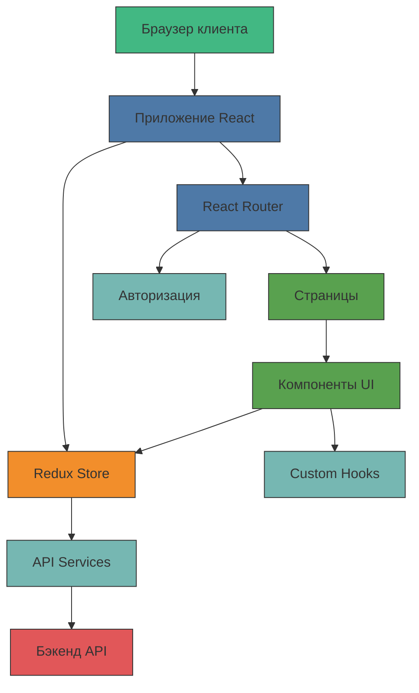
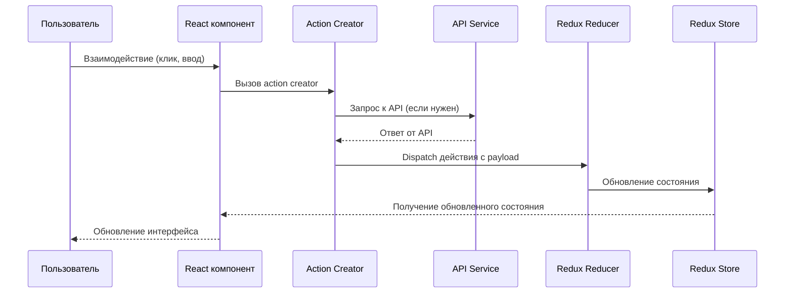
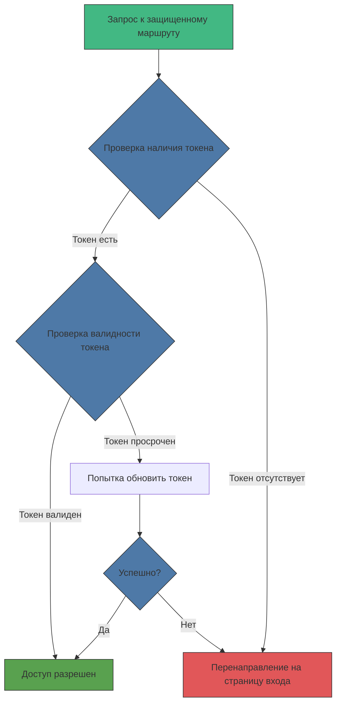
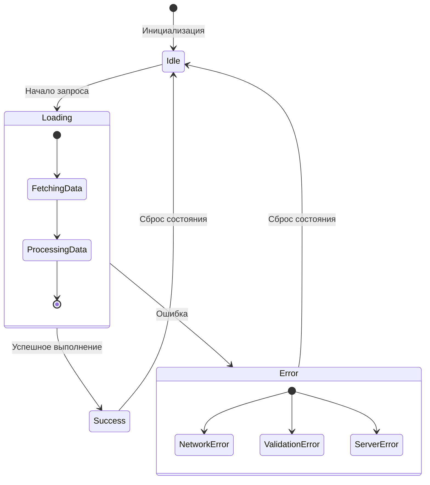
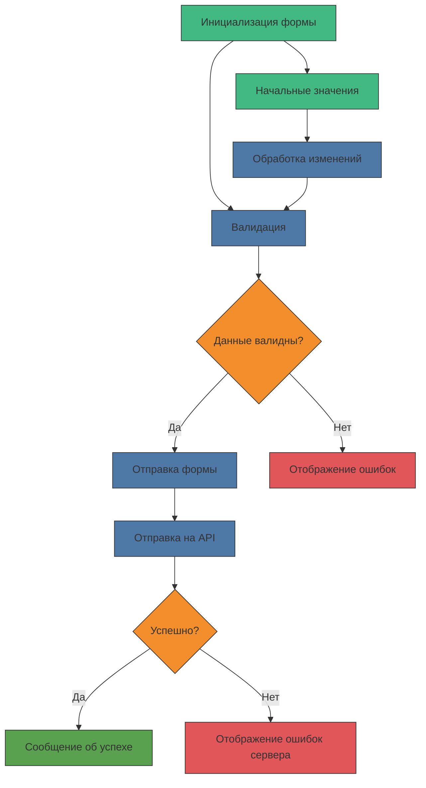

# Структура фронтенда

В этом документе описана структура фронтенд-части проекта с использованием диаграмм Mermaid.js.

## Общая архитектура фронтенда



## Структура компонентов

```mermaid
graph TD
    App[App] --> Layout[Layout]
    Layout --> Header[Header]
    Layout --> Sidebar[Sidebar]
    Layout --> Content[Content]
    Layout --> Footer[Footer]
    
    Content --> Routes[Routes]
    Routes --> HomePage[HomePage]
    Routes --> LoginPage[LoginPage]
    Routes --> RegisterPage[RegisterPage]
    Routes --> ProductsPage[ProductsPage]
    Routes --> ProductDetailPage[ProductDetailPage]
    Routes --> CartPage[CartPage]
    Routes --> CheckoutPage[CheckoutPage]
    Routes --> OrdersPage[OrdersPage]
    Routes --> ProfilePage[ProfilePage]
    Routes --> NotFoundPage[404 Page]
    
    HomePage --> FeaturedProducts[FeaturedProducts]
    HomePage --> CategoryList[CategoryList]
    HomePage --> Hero[Hero Banner]
    
    ProductsPage --> ProductList[ProductList]
    ProductsPage --> Filters[Filters]
    ProductsPage --> Pagination[Pagination]
    
    ProductDetailPage --> ProductImages[ProductImages]
    ProductDetailPage --> ProductInfo[ProductInfo]
    ProductDetailPage --> AddToCart[AddToCart]
    ProductDetailPage --> Reviews[Reviews]
    
    CartPage --> CartItems[CartItems]
    CartPage --> CartSummary[CartSummary]
    
    CheckoutPage --> ShippingForm[ShippingForm]
    CheckoutPage --> PaymentForm[PaymentForm]
    CheckoutPage --> OrderSummary[OrderSummary]
    
    ProfilePage --> UserDetails[UserDetails]
    ProfilePage --> AddressList[AddressList]
    ProfilePage --> OrderHistory[OrderHistory]
    
    classDef page fill:#4e79a7,stroke:#333,stroke-width:1px;
    classDef layout fill:#f28e2b,stroke:#333,stroke-width:1px;
    classDef component fill:#59a14f,stroke:#333,stroke-width:1px;
    
    class App,Layout,Header,Sidebar,Content,Footer layout;
    class HomePage,LoginPage,RegisterPage,ProductsPage,ProductDetailPage,CartPage,CheckoutPage,OrdersPage,ProfilePage,NotFoundPage page;
    class Routes,FeaturedProducts,CategoryList,Hero,ProductList,Filters,Pagination,ProductImages,ProductInfo,AddToCart,Reviews,CartItems,CartSummary,ShippingForm,PaymentForm,OrderSummary,UserDetails,AddressList,OrderHistory component;
```



## Структура файлов

```
/frontend
├── public/               # Статические файлы
│   ├── index.html        # Основной HTML файл
│   ├── favicon.ico       # Иконка сайта
│   └── assets/           # Статические ресурсы (изображения, шрифты)
│
├── src/                  # Исходный код приложения
│   ├── index.js          # Точка входа в приложение
│   ├── App.js            # Корневой компонент приложения
│   ├── routes/           # Настройка маршрутизации
│   │   └── index.js      # Определение маршрутов
│   │
│   ├── pages/            # Компоненты страниц
│   │   ├── HomePage/     
│   │   ├── LoginPage/
│   │   ├── RegisterPage/
│   │   ├── ProductsPage/
│   │   ├── ProductDetailPage/
│   │   ├── CartPage/
│   │   ├── CheckoutPage/
│   │   ├── OrdersPage/
│   │   ├── ProfilePage/
│   │   └── NotFoundPage/
│   │
│   ├── components/       # Многоразовые компоненты UI
│   │   ├── Layout/       # Компоненты для разметки
│   │   │   ├── Header/
│   │   │   ├── Sidebar/
│   │   │   ├── Footer/
│   │   │   └── index.js
│   │   │
│   │   ├── UI/           # Базовые компоненты UI
│   │   │   ├── Button/
│   │   │   ├── Input/
│   │   │   ├── Card/
│   │   │   ├── Modal/
│   │   │   └── ...
│   │   │
│   │   ├── Products/     # Компоненты для работы с продуктами
│   │   │   ├── ProductList/
│   │   │   ├── ProductCard/
│   │   │   ├── ProductFilters/
│   │   │   └── ...
│   │   │
│   │   ├── Cart/         # Компоненты для корзины
│   │   │   ├── CartItem/
│   │   │   ├── CartSummary/
│   │   │   └── ...
│   │   │
│   │   └── User/         # Компоненты для пользователя
│   │       ├── LoginForm/
│   │       ├── RegisterForm/
│   │       └── ...
│   │
│   ├── hooks/            # Пользовательские React хуки
│   │   ├── useAuth.js
│   │   ├── useCart.js
│   │   ├── useForm.js
│   │   └── ...
│   │
│   ├── store/            # Redux store
│   │   ├── index.js      # Конфигурация store
│   │   ├── actions/      # Action creators
│   │   │   ├── authActions.js
│   │   │   ├── productActions.js
│   │   │   ├── cartActions.js
│   │   │   └── ...
│   │   │
│   │   ├── reducers/     # Reducers
│   │   │   ├── authReducer.js
│   │   │   ├── productReducer.js
│   │   │   ├── cartReducer.js
│   │   │   └── ...
│   │   │
│   │   └── types.js      # Константы типов действий
│   │
│   ├── services/         # Сервисы API
│   │   ├── api.js        # Базовая настройка axios
│   │   ├── authService.js
│   │   ├── productService.js
│   │   ├── orderService.js
│   │   └── ...
│   │
│   ├── utils/            # Вспомогательные функции
│   │   ├── helpers.js
│   │   ├── validation.js
│   │   ├── formatting.js
│   │   └── ...
│   │
│   ├── assets/           # Локальные ресурсы
│   │   ├── images/
│   │   ├── styles/
│   │   └── ...
│   │
│   └── constants/        # Константы приложения
│       ├── routes.js
│       ├── api.js
│       └── ...
│
├── tests/                # Тесты
│   ├── unit/             # Модульные тесты
│   ├── integration/      # Интеграционные тесты
│   └── e2e/              # End-to-end тесты
│
├── .env                  # Переменные окружения
├── .env.development      # Переменные для разработки
├── .env.production       # Переменные для продакшна
├── .eslintrc             # Конфигурация ESLint
├── .prettierrc           # Конфигурация Prettier
├── package.json          # Зависимости и скрипты
└── README.md             # Документация фронтенда
```

## Поток данных (Redux Flow)



## Авторизация и защита маршрутов



## Управление состоянием загрузки и ошибками



## Обработка форм



## Оптимизация производительности

Для оптимизации производительности фронтенд-приложения рекомендуется использовать следующие подходы:

1. **Code Splitting** - разделение кода на более мелкие части для загрузки по требованию:

```mermaid
graph TD
    App[App] -->|Базовый бандл| MainBundle[Основной бандл]
    App -->|Ленивая загрузка| LazyRoutes[Lazy Routes]
    
    LazyRoutes -->|import()| Admin[Админ-панель]
    LazyRoutes -->|import()| ProductDetail[Детальная страница продукта]
    LazyRoutes -->|import()| Checkout[Оформление заказа]
    
    classDef main fill:#42b883,stroke:#333,stroke-width:1px;
    classDef lazy fill:#4e79a7,stroke:#333,stroke-width:1px;
    classDef chunk fill:#f28e2b,stroke:#333,stroke-width:1px;
    
    class App,MainBundle main;
    class LazyRoutes lazy;
    class Admin,ProductDetail,Checkout chunk;
```

2. **Memoization** - использование React.memo, useMemo и useCallback для предотвращения лишних рендеров.
3. **Virtualization** - для длинных списков использовать виртуализацию с помощью библиотек типа react-window.
4. **Progressive Loading** - загрузка изображений и других ресурсов постепенно или по мере необходимости.

Эта документация поможет начинающему разработчику понять структуру фронтенд-приложения, его компоненты и взаимодействие между ними. Диаграммы Mermaid.js визуально представляют поток данных и архитектуру, что упрощает понимание сложных концепций. 